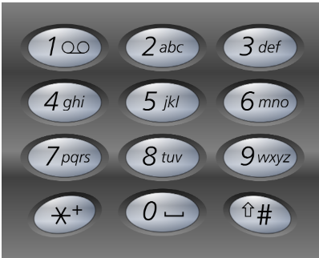

# 17. 电话号码的字母组合（中等）

---

## 题目

给定一个仅包含数字 `2-9` 的字符串，返回所有它能表示的字母组合。



```
输入：digits = "23"
输出：["ad","ae","af","bd","be","bf","cd","ce","cf"]
```

---

## 你的关键思路

> 1. HashMap 存储数字和字母间的对应关系
> 2. String 不方便直接添加和删除字符，采用 StringBuilder 进行操作，最后转成 String
> 3. 传入的 index 在递归时用 `index + 1`，不能写成 `index++`（会改变当前层的值，回溯时无法复原）

---

## 你的代码

```java
class Solution {
    public List<String> letterCombinations(String digits) {
        List<String> combinations = new ArrayList<>();
        if(digits.length() == 0){
            return combinations;
        }
        Map<Character, String> phoneMap = new HashMap<>() {{
            put('2', "abc");
            put('3', "def");
            put('4', "ghi");
            put('5', "jkl");
            put('6', "mno");
            put('7', "pqrs");
            put('8', "tuv");
            put('9', "wxyz");
        }};
        backtrack(combinations, phoneMap, digits, new StringBuilder(), 0);
        return combinations;
    }

    private void backtrack(List<String> combinations, Map<Character, String> phoneMap, String digits, StringBuilder container, int index){
        if(container.length() == digits.length()){
            combinations.add((container.toString()));
            return;
        }
        char digit = digits.charAt(index);
        String letters = phoneMap.get(digit);
        for(int i = 0; i < letters.length(); i++){
            container.append(letters.charAt(i));
            backtrack(combinations, phoneMap, digits, container, index + 1);
            container.deleteCharAt(container.length() - 1);
        }
    }
}
```
---

## 复杂度

- 时间：O(4ⁿ × n)，每个数字最多 4 种字母，n = digits 长度
- 空间：O(n)，递归栈 + StringBuilder
