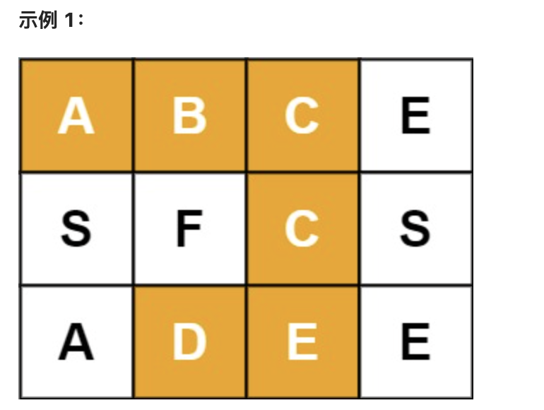

# 79. 单词搜索

---

## 题目

给定一个 `m x n` 的网格 `board` 和一个字符串 `word`，如果 `word` 存在于网格中返回 `true`。每个单元格的字母只能用一次（不能重复使用）。

```
输入：board = [["A","B","C","E"],
              ["S","F","C","S"],
              ["A","D","E","E"]]
      word = "ABCCED"
输出：true
```

---

## 你的关键思路

> （你写）

---

## 你的代码

```java
// （你写）
```

---

## 复杂度

- 时间：O( )
- 空间：O( )
