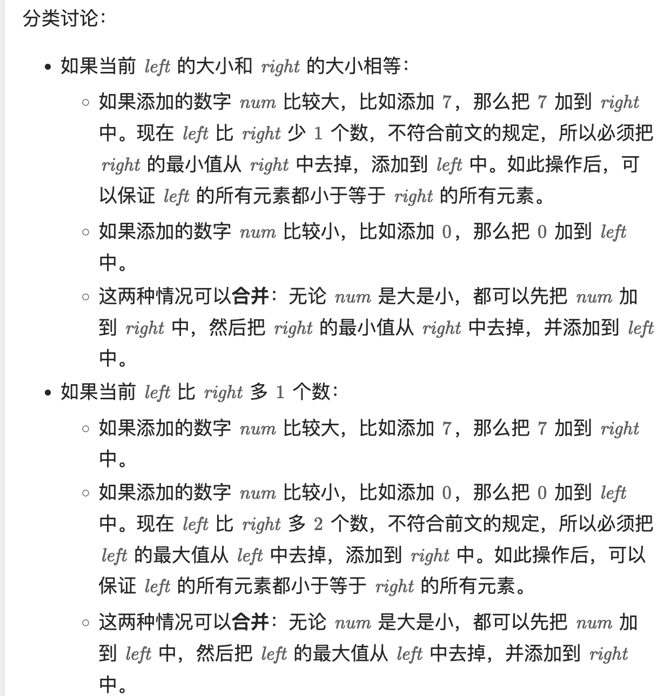

# 295. 数据流的中位数（困难）

---

## 题目

中位数是有序整数列表中的中间值。实现 `MedianFinder` 类：支持 `addNum(int num)` 添加整数，`findMedian()` 返回当前所有元素的中位数。要求两个操作的时间复杂度 ≤ O(log n)。

```
输入：
["MedianFinder","addNum","addNum","findMedian","addNum","findMedian"]
[[],[1],[2],[],[3],[]]

输出：[null,null,null,1.5,null,2.0]
```

---

## 你的关键思路

> 1. **双堆对半分**：left 是大根堆（存较小的一半），right 是小根堆（存较大的一半），中位数就在两个堆顶之间
> 2. **不变式**：`left.size() == right.size()` 或 `left.size() == right.size() + 1`——left 永远不比 right 少，最多多 1 个
> 3. **"先加再调"技巧**（不用判断 num 大小）：
>    - left 和 right 等大 → 先把 num 加入 right，再弹出 right 最小值挤进 left
>    - left 比 right 多 1 → 先把 num 加入 left，再弹出 left 最大值挤进 right
>    - 挤出的正好是"跨过半界的那个数"，天然维持 left 全部 ≤ right 全部
> 4. **findMedian**：等大 → (left.peek + right.peek)/2；left 多 1 → left.peek
> 5. **为什么选堆**：需要"添加元素 + 找最大/最小值 + 删最大/最小值"三个操作都高效——堆满足，三者都是 O(log n)/O(1)
> 6. 和 215/347 的联系：都是"需要维护有序性 → 选堆"，这题进阶成两个堆对半分



题解：[灵茶山艾府 - 如何自然引入大小堆（LeetCode）](https://leetcode.cn/problems/find-median-from-data-stream/solutions/3015873/ru-he-zi-ran-yin-ru-da-xiao-dui-jian-ji-4v22k/?envType=study-plan-v2&envId=top-100-liked)

---

## 你的代码

```java
class MedianFinder {
    private final PriorityQueue<Integer> left;
    private final PriorityQueue<Integer> right;

    public MedianFinder() {
        left = new PriorityQueue<>((a, b) -> b - a);  // 手动构建最大堆
        right = new PriorityQueue<>();  // 最小堆
    }
    
    public void addNum(int num) {
        if(left.size() == right.size()){
            right.offer(num);
            left.offer(right.poll());
        }else{
            left.offer(num);
            right.offer(left.poll());
        }
    }
    
    public double findMedian() {
        if(left.size() == right.size()){
            return (left.peek() + right.peek()) / 2.0;
        }else{
            return left.peek();
        }
    }
}
```

---

## 复杂度

- 时间：addNum O(log n)，findMedian O(1)
- 空间：O(n)
