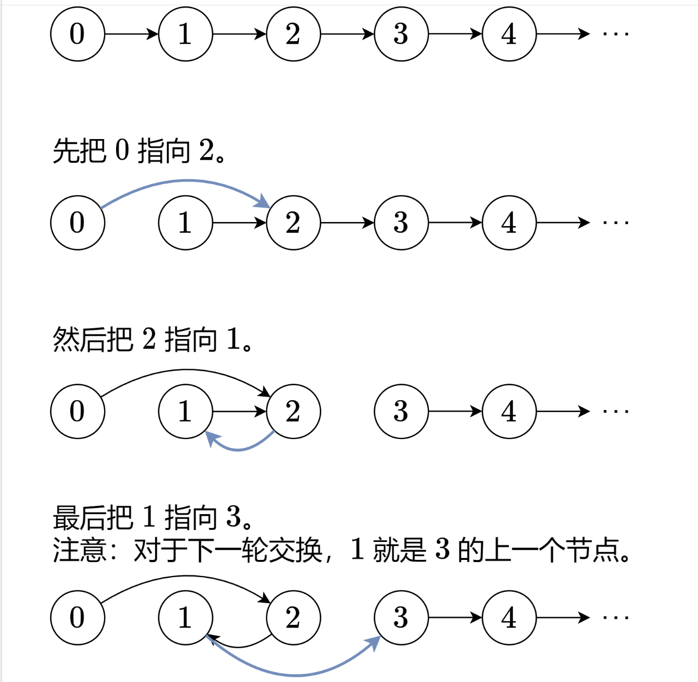

---
tags:
  - 难度/中等
  - 二刷
  - 需要巩固
publish: true
---

# 24. 两两交换链表中的节点

---

## 题目

给你一个链表，两两交换其中相邻的节点，并返回交换后链表的头节点。你必须在不修改节点内部的值的情况下完成本题（即，只能进行节点交换）。

```
输入：head = [1,2,3,4]
输出：[2,1,4,3]

输入：head = []
输出：[]

输入：head = [1]
输出：[1]
```

---

## 你的关键思路

> 1.引入 dummy 节点，减少边界处理
> 2.操作过程中，需要用到 4 个节点，具体交换流程见下图



---

## 你的代码

```java
class Solution {
    public ListNode swapPairs(ListNode head) {
        ListNode dummy = new ListNode(0, head);
        ListNode node0 = dummy, node1 = head;
        while(node1 != null && node1.next != null){
            ListNode node2 = node1.next, node3 = node2.next;
            node0.next = node2;
            node2.next = node1;
            node1.next = node3;

            node0 = node1;
            node1 = node3;
        }
        return dummy.next;
    }
}
```

> **补充（指针调整顺序的记忆法）**：
> 1. 四个指针：node0（对的前驱）、node1（对的第一）、node2（对的第二）、node3（对的后继）
> 2. 交换三步走：`node0.next = node2` → `node2.next = node1` → `node1.next = node3`——**先接前、再反连、后接续**
> 3. 移动：`node0 = node1`（前一对待的第一，成为后一对的前驱）、`node1 = node3`（跳到下一位）
> 4. 和 25 题的关系：这题是 25 的 k=2 特例，25 是"数够 k 个再翻转"，这题是"固定两个"——**先刷这题再看 25 会容易很多**
> 5. 循环条件 `node1 != null && node1.next != null`：不足一对就不处理

[leetcode🔗 两两交换链表中的节点](https://leetcode.cn/problems/swap-nodes-in-pairs/description/?envType=study-plan-v2&envId=top-100-liked)

---

## 复杂度

- 时间：O(n)，每个节点访问一次
- 空间：O(1)
