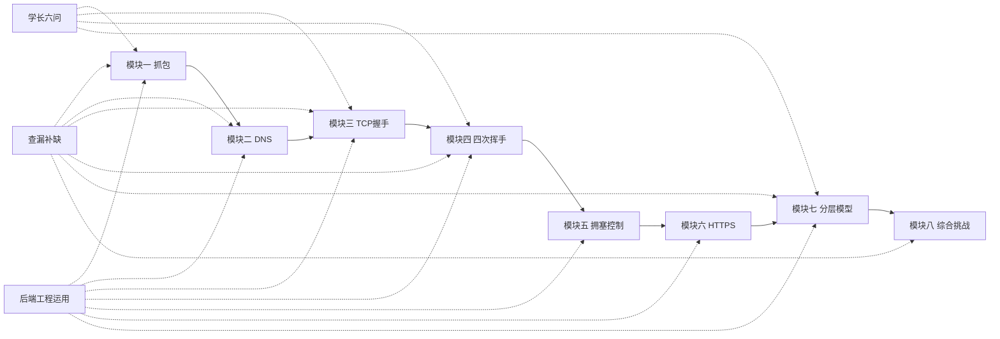

# 🌐 计算机网络知识图谱

> 这是你的计网学习 vault 的 **知识索引页**。每篇笔记都已通过 wiki-link 互联，点击即可跳转。

---

## 🗺️ 学习路线总览



---

## 📋 总体规划

| 笔记 | 说明 |
|------|------|
| [[计算机网络-任务驱动学习计划]] | 8 周学习计划，每个模块的交付目标、时间安排 |
| [[Java-AI工程方向成长路线规划]] | 大一~大二整体成长路线，计网是暑假关键一环 |

---

## 🔤 核心学习流（8 个模块，顺序递进）

### ① 入门篇
- [[第一次抓包：我看到了网络请求的样子]] — Wireshark 抓包、HTTP 报文、状态码

### ② 域名篇
- [[DNS解析：从域名到IP发生了什么]] — 域名层级、dig 命令、递归/迭代查询

### ③ TCP 连接篇 ⭐
- [[TCP三次握手：我用Java亲手建立了一条连接]] — Java Socket、SYN/SYN-ACK/ACK、SEQ/ACK
- [[TCP四次挥手与可靠传输]] — 四次挥手、TIME_WAIT、可靠传输机制
- [[TCP拥塞控制：网络塞车了怎么办]] — 慢启动、拥塞避免、MSS/MTU

### ④ 安全篇
- [[HTTPS与加密：你的数据是这样被保护的]] — TLS 握手、数字证书、混合加密

### ⑤ 串联篇
- [[网络分层模型：一张图串起所有协议]] — OSI/TCP/IP 分层、协议栈全景
- [[从输入URL到页面展示：一次完整的网络旅行]] — **综合挑战**，覆盖全部知识点

---

## 🧠 横向串联笔记

| 笔记 | 定位 | 关联模块 |
|------|------|---------|
| [[学长六问：协议分工、分层封装、TCP开销与协议设计]] | 学长 6 个深度问题横跨全部模块 | ①③④⑤⑥⑦ |
| [[计网查漏补缺：剩下的20%知识点]] | 补齐面试高频考点（ARP/ICMP/HTTP缓存等） | ①②③④⑦⑧ |
| [[计网知识在后端工程中的运用]] | 计网知识 → SpringBoot/云部署工程落地 | ①②③④⑤⑥⑦ |

---

## 🔗 数据依赖关系

```
TCP四次挥手与可靠传输 ──基于同一份抓包数据──→ TCP三次握手
TCP拥塞控制 ────────────扩展 Java 代码──────→ TCP三次握手（13B → 4MB）
```

---

## 📈 学习进度追踪

- [ ] **模块一**：[[第一次抓包：我看到了网络请求的样子]]
- [ ] **模块二**：[[DNS解析：从域名到IP发生了什么]]
- [ ] **模块三**：[[TCP三次握手：我用Java亲手建立了一条连接]]
- [ ] **模块四**：[[TCP四次挥手与可靠传输]]
- [ ] **模块五**：[[TCP拥塞控制：网络塞车了怎么办]]
- [ ] **模块六**：[[HTTPS与加密：你的数据是这样被保护的]]
- [ ] **模块七**：[[网络分层模型：一张图串起所有协议]]
- [ ] **模块八**：[[从输入URL到页面展示：一次完整的网络旅行]]
- [ ] **横向**：[[学长六问：协议分工、分层封装、TCP开销与协议设计]]
- [ ] **查漏**：[[计网查漏补缺：剩下的20%知识点]]
- [ ] **落地**：[[计网知识在后端工程中的运用]]

---

> **提示**：在 Obsidian 的**图谱视图**（Graph View）中打开本 vault，可以看到所有笔记的互联关系。
