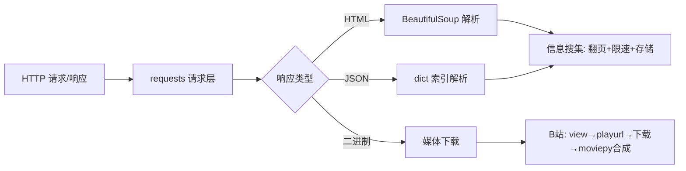

# 爬虫知识地图

> requests + BeautifulSoup 实现的爬虫学习笔记：信息搜集、媒体下载、工程化与合规。全部要点均经实测验证。

## 学习目标

- [x] 输入任意 B 站 BV 号 → 输出完整视频（360P ✅ / 1080P ✅ 带 Cookie）
- [x] 搜集静态网站信息并存成文件（豆瓣 250 部 ✅ / CSV ✅）
- 学习深度：借助 AI 写爬虫，但必须**读懂代码、理解实现**，能自己爬图片、视频、搜集信息

## 已有基础

- Python 基础：循环、字典、文件读写
- .venv 虚拟环境、PyCharm + 终端跑脚本
- 依赖：requests、beautifulsoup4、moviepy、numpy、PIL

## 领域清单

- [[0-基础概念]] — HTTP 请求/响应、HTML/JSON、爬虫流水线
- [[1-请求层]] — requests 核心 API、状态码、编码、伪装、认证
- [[2-解析层]] — BeautifulSoup、CSS 选择器、JSON 解析
- [[3-媒体下载]] — 短时签名 URL、B 站三步走、moviepy 合成
- [[4-工程化与合规]] — Session、重试、代理、安全合规
- [[5-存储]] — CSV / JSON / SQLite
- [[6-速查表]] — API 速查与常见坑

## 知识地图

## 概念关系表

| 概念 | 所属领域 | 前置概念 | 关系说明 |
| --- | --- | --- | --- |
| requests | [[1-请求层]] | HTTP 请求/响应 | 发请求、拿响应对象 |
| raise_for_status | [[1-请求层]] | requests | 非 2xx 抛异常，防错误页被当数据 |
| BeautifulSoup | [[2-解析层]] | HTTP、HTML | 把 HTML 变文档树，select 提取 |
| 短时签名 URL | [[3-媒体下载]] | — | CDN 防盗链，deadline+签名，地址需动态获取 |
| moviepy | [[3-媒体下载]] | — | m4s 双流（视频+音频）合成 |
| Session | [[4-工程化与合规]] | requests | 复用连接+Cookie+统一 headers |
| time.sleep | [[4-工程化与合规]] | — | 限速，礼貌爬虫防 418 |
| csv.writer | [[5-存储]] | — | 标准库写 CSV，utf-8-sig 防乱码 |

## 用户约定

- 笔记按知识领域分开写，一个领域一篇，不混在一个大文件
- 每个知识点配**能直接运行**的示例代码
- 小步输出，不一次性倾倒长文；用户先自己读代码，有疑问再问
- 练习以"读懂示例 + 会改 + 能审阅 AI 产出"为主，关键概念配动手验证
- 合规底线：**小号 + 低频 + 少量 + 限速 + 遇 403 即停**，个人学习可以，批量商用不行

## 已实测的证据

- 豆瓣裸请求 418 / 带 UA 200
- 豆瓣 Top250 翻页爬满 250 部，末行 = 第 250 名
- B 站 view→playurl→下载全流程跑通，360P mp4（v2）
- 带 SESSDATA Cookie → playurl 返回 dash 双流，1080P 合成成功（v3）
- 403 错误页被写成 .mp4 → moviepy 报 moov atom not found
- 豆瓣图片 CDN 偶发返回 JS 挑战页（200 + HTML）——**200 不代表内容正确**
- Clash 7897 代理连通，出口 IP 变台湾
- Pixiv 搜索 API→详情 API→下载 5 张原图全部成功

## 待验证的推断 / 下一步行动

- [ ] JS 挑战页（豆瓣图片 CDN）终极解法：浏览器自动化（playwright/selenium），requests 绕不过
- [ ] JSON / SQLite 存储（CSV 之外的两种形态）
- [ ] 多线程/异步提升效率——**注意并发会放大风控风险**
- [ ] 换个网站目标把全流程再走一遍（巩固）

## 参考

- [[规则说明]] — 这套笔记的编写规则与命名规范
