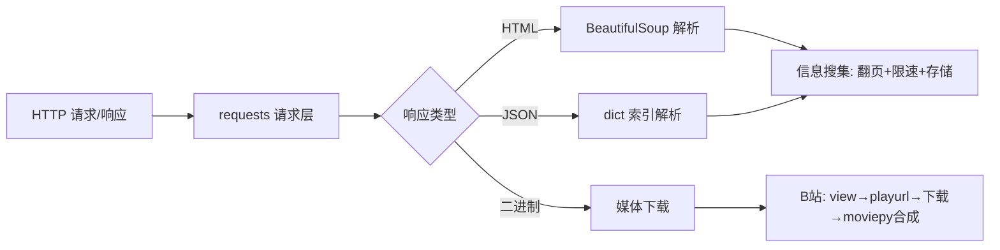

# 技术全景：crawler（爬虫）

## 学习目标
- [x] 学完能独立做出：输入任意 B 站 BV 号 → 输出完整视频（360P ✅；高清 1080P ✅ 带 Cookie）
- [ ] 学完能独立做出：搜集静态网站信息并存成文件（豆瓣 250 部 ✅；存成 CSV ✅）
- 学习深度/用途：混合——借助 AI 写爬虫（提需求让 AI 写），但必须能**读懂代码、理解实现**；目标是能自己爬图片、视频、搜集信息

## 已有基础
- Python 基础：循环、字典、文件读写
- .venv 虚拟环境概念已懂，会用 PyCharm + 终端跑脚本
- 已装依赖：requests、beautifulsoup4、moviepy、numpy、PIL
- 已完成练习：`first_exercise.py`（请求B站首页）、`douban_exercise.py`（Top250 翻页爬250部）、`scrape_vodeo_exercise.py`（B站下载器v2）、`scrape_vodeo_hd.py`（v3 高清双流 已验证1080P）、`scrape_douban_posters.py`（海报下载 25张）、`douban_save_csv.py`（Top250 存 CSV）、`scrape_vodeo_hd_session.py`（v4 Session+重试）、`pixiv_proxy_test.py`（代理连通测试）、`pixiv_downloader.py`（Pixiv 爬图 5张原图 ✅）

## 用户约定（对话中随时补充，把用户的要求外部化到这里）
- 笔记按"知识领域"分开写，不混在一个大文件
- **笔记文件结构（2026-08-05）**：一个领域一个文件（`领域一-基础概念.md` ~ `领域六-存储.md`），知识按领域归类；总览/进度/约定在 技术全景.md；每份领域笔记含 front matter 进度字段
- 每个知识点要配**能直接运行**的示例代码
- 学习节奏以用户为准：说"还没消化"就暂停细讲
- 讲解方式（2026-08-04）：**小步输出**，不一次性倾倒长文；用户先自己读代码，有疑问再问
- 笔记边界（2026-08-04）：**笔记只留结构化知识点**（概念/示例/练习记录）；简短的 Q&A 解释直接写进**代码注释**，不塞进笔记避免臃肿
- 记录价值判断（2026-08-04）：往笔记里记**任何内容前先评估有没有价值**，不确定就问用户
- 学习深度（2026-08-04）：混合。可借助 AI 写爬虫、提需求，但必须自己**看得懂代码、理解爬虫怎么实现**；练习以"读懂示例 + 会改 + 能审阅 AI 产出"为主，关键概念配动手验证
- 目标用例：爬取网站图片、视频、搜集信息

## 领域清单
| 领域 | 包含概念 | 学习顺序 |
| --- | --- | --- |
| 领域一 基础概念 | HTTP请求/响应、HTML与JSON文档、爬虫流水线 | 1 |
| 领域二 请求层 | requests核心API、状态码、编码、超时、伪装 | 2（✅已学） |
| 领域三 解析层 | BeautifulSoup、CSS选择器、JSON解析 | 3（✅已学） |
| 领域四 媒体下载 | 二进制下载、B站JSON API、m4s双流、moviepy合成 | 4（✅全部：三步走/图片/Cookie高清v3） |
| 领域五 常用模式与工程化 | 翻页、限速、反爬伪装、Session/重试、代理 | 5（✅已学全部） |
| 领域六 存储 | CSV/JSON/SQLite | 6（✅CSV已学；JSON/SQLite 进阶） |

## 知识地图

## 概念关系表
| 概念 | 所属领域 | 前置概念 | 关系说明 |
| --- | --- | --- | --- |
| requests | 领域二 | HTTP 请求/响应 | 发请求、拿响应对象 |
| raise_for_status | 领域二 | requests | 非2xx抛异常，防错误页被当数据 |
| BeautifulSoup | 领域三 | HTTP、HTML | 把 HTML 变文档树，select 提取 |
| 短时签名URL | 领域四 | — | CDN防盗链，deadline+签名，地址需动态获取 |
| moviepy | 领域四 | — | m4s 双流（视频+音频）合成 |
| time.sleep | 领域五 | — | 限速，礼貌爬虫防 418 |

## 待验证的推断
- [x] 带登录 Cookie 后，playurl 会返回 `dash` 双流（视频m4s+音频m4s 分离）——已实测（1080P）
- [x] B 站部分接口需 wbi 签名——playurl/view 实测不需要
- [ ] JS 挑战页（豆瓣图片 CDN）终极解法：浏览器自动化（playwright/selenium），requests 绕不过
